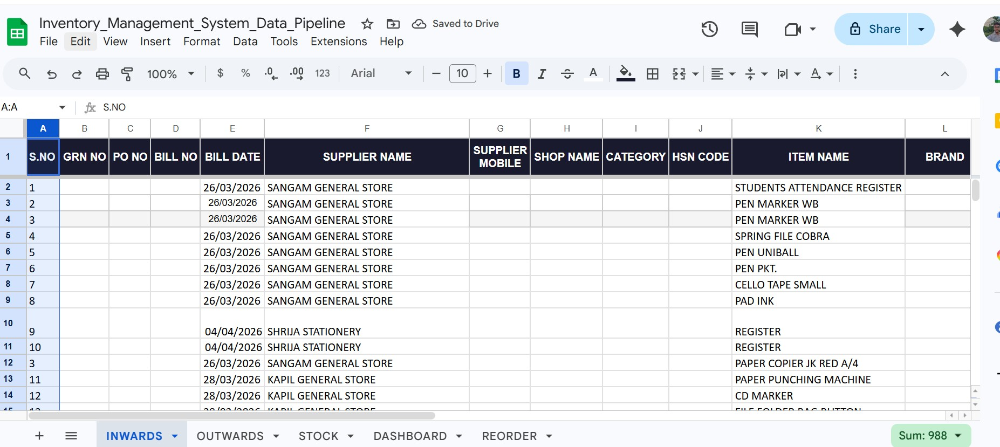
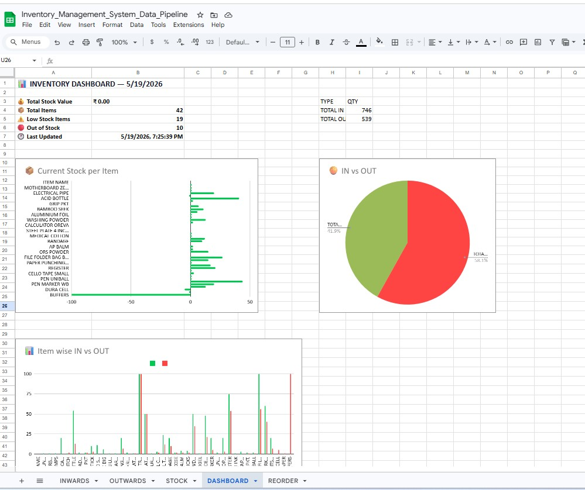
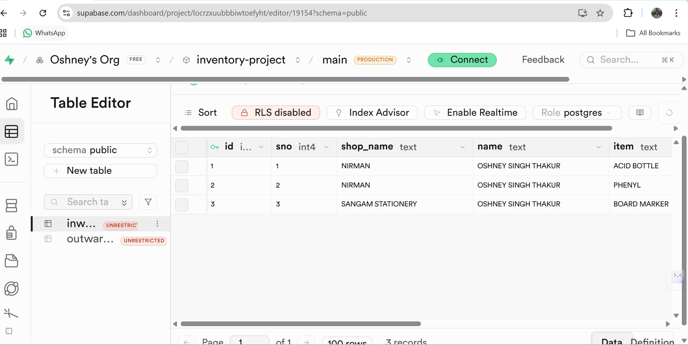
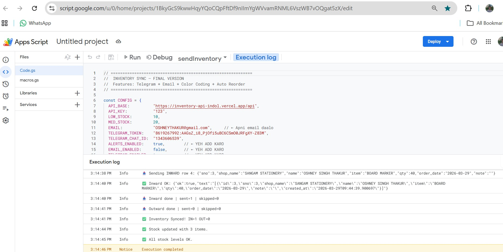
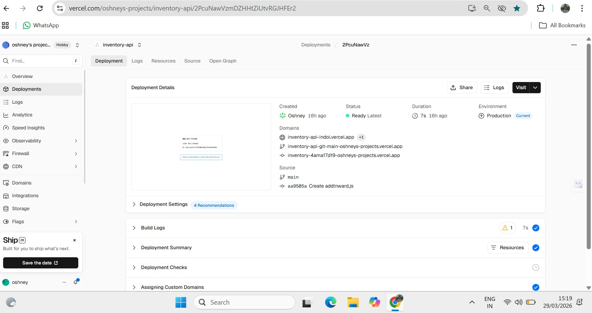
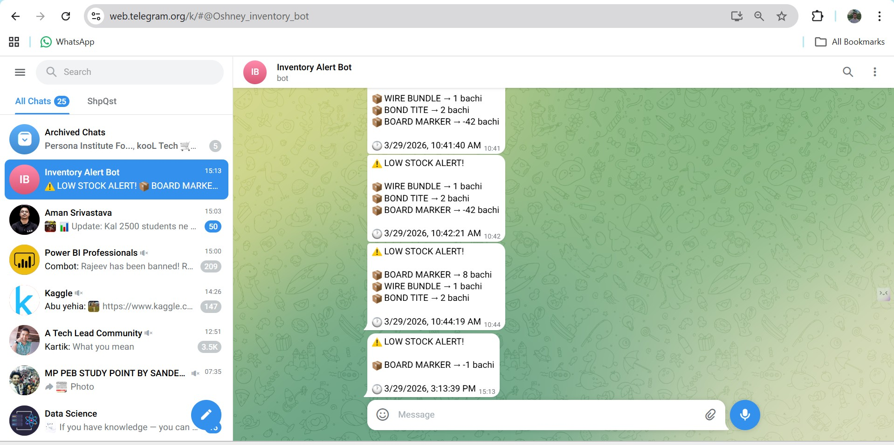
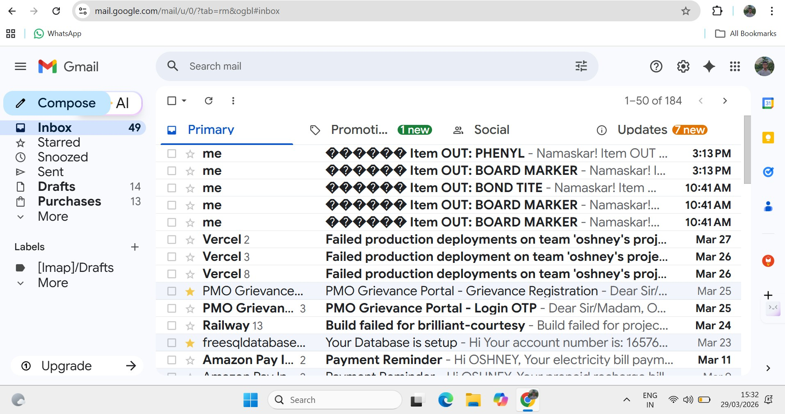

# 📦 Inventory Management Data Pipeline

> **A real-world automated inventory data pipeline built for a school store — eliminating manual reporting through Google Sheets → Vercel REST API → Supabase PostgreSQL → Telegram alerts.**


[](mailto:oshneythakur@gmail.com)

---

## 🎯 The Problem

As MIS Executive at DPS School, I managed school store inventory 
reporting manually using basic Google Sheets formulas. 
The real problems were:

- ❌ No way to search stock by item, date, or supplier
- ❌ No alerts when stock ran critically low — items ran out without warning
- ❌ Data had no permanent backup or database
- ❌ No SQL analysis possible on raw data
- ❌ Hours wasted on manual inventory reporting every week

---

## ✅ The Solution — What I Built

An end-to-end automated inventory pipeline where:

- Staff enters data in **Google Sheets** (no learning curve)
- Data **automatically syncs to PostgreSQL** via REST API every 5 minutes
- Stock is **calculated in real time** — no manual counting
- **Telegram bot sends instant alerts** when stock drops below threshold
- Full **SQL analysis available** on live data via Supabase
- **27-column INWARDS** and **28-column OUTWARDS** tracking with GST, HSN Code, Supplier Mobile
- **Auto REORDER sheet** populated when stock drops below threshold
- **Dashboard** with 3 auto-generated charts updated on every sync

**Impact:** Eliminated manual stock counting. Zero stockouts since deployment.

---

## 🛠️ Tech Stack

| Tool | Role |
|------|------|
| Google Sheets | Data entry interface for non-technical staff |
| Google Apps Script | Automation, scheduling, trigger logic |
| Vercel | REST API deployment (Node.js serverless) |
| Supabase (PostgreSQL) | Cloud database — 3 tables: inwards, outwards, stock_summary |
| Telegram Bot API | Instant low-stock alerts |
| GitHub | Version control and project documentation |
| Postman | API testing and endpoint verification |

---

## 🔄 Architecture

```
┌─────────────────┐     ┌──────────────────┐     ┌───────────────────┐
│  Google Sheets  │────▶│  Apps Script     │────▶│  Vercel API       │
│  (Data Entry)   │     │  (Auto trigger   │     │  /api/addInward   │
│  INWARDS sheet  │     │   every 5 min)   │     │  /api/addOutward  │
│  OUTWARDS sheet │     └──────────────────┘     │  /api/stock       │
└─────────────────┘                               └────────┬──────────┘
                                                           │
                                                           ▼
                                                  ┌─────────────────────┐
                                                  │    Supabase         │
                                                  │  PostgreSQL DB      │
                                                  │  ├─ inwards table   │
                                                  │  ├─ outwards table  │
                                                  │  └─ stock_summary   │
                                                  └────────┬────────────┘
                                                           │
                    ┌──────────────────────────────────────┤
                    │                                      │
                    ▼                                      ▼
     ┌──────────────────────────┐         ┌───────────────────────────┐
     │ Google Sheets            │         │   Low Stock Alerts        │
     │ 📊 STOCK sheet           │         │                           │
     │ 🟢 Green  > 20          │         │  ┌─────────────────────┐  │
     │ 🟡 Yellow > 10          │         │  │  Telegram Bot        │  │
     │ 🔴 Red    < 10          │         │  │  Instant alerts      │  │
     │ ⚫ Black  = 0           │         │  └─────────────────────┘  │
     │ 📊 DASHBOARD charts      │         │  ┌─────────────────────┐  │
     │ 📋 REORDER sheet         │         │  │  Gmail Alert         │  │
     └──────────────────────────┘         │  │  (configurable)      │  │
                                          │  └─────────────────────┘  │
                                          └───────────────────────────┘

---

## 🚀 How It Works — Step by Step

1. Staff fills **INWARDS** sheet (supplier delivery) or **OUTWARDS** sheet (sale to customer)
2. **Apps Script triggers automatically** every 5 minutes — scans for new rows
3. New rows are sent to **Vercel REST API** as POST requests
4. Vercel saves data to **Supabase PostgreSQL** (`inwards` and `outwards` tables)
5. **Stock is calculated** per item: `total_in - total_out = current_stock`
6. **Color coding applied** in STOCK sheet — Green / Yellow / Red
7. If any item drops below 10 units → **Telegram alert fires instantly + Gmail alert sent**
8. Item auto-added to **REORDER sheet** for procurement tracking

---

## 📸 Screenshots


### INWARDS Sheet — Stock Entry from Supplier


### OUTWARDS Sheet — Sales Entry to Customer


### STOCK Sheet — Real-time Color Coded Stock


### DASHBOARD


### Supabase Database — PostgreSQL Tables


### Apps Script — Execution Log


### Vercel — Live Deployment


### Telegram Bot — Low Stock Alert


### Gmail — Low Stock Alert

---

## 🌐 Live API Endpoints

Base URL: `https://inventory-api-indol.vercel.app`

| Method | Endpoint | Description |
|--------|----------|-------------|
| `GET` | `/api/stock` | Returns current stock for all items |
| `POST` | `/api/addInward` | Add new inward (supplier delivery) entry |
| `POST` | `/api/addOutward` | Add new outward (sale) entry |

Try it live:
```
https://inventory-api-indol.vercel.app/api/stock
```

---

## 📊 SQL Analysis Examples

```sql
-- Current stock per item
SELECT
  i.item,
  SUM(i.qty)                            AS total_in,
  COALESCE(SUM(o.qty), 0)              AS total_out,
  SUM(i.qty) - COALESCE(SUM(o.qty), 0) AS current_stock
FROM inwards i
LEFT JOIN outwards o ON i.item = o.item
GROUP BY i.item
ORDER BY current_stock ASC;

-- Top selling items
SELECT item, SUM(qty) AS total_sold
FROM outwards
GROUP BY item
ORDER BY total_sold DESC
LIMIT 10;

-- Sales by customer
SELECT
  customer_name,
  COUNT(*)         AS total_orders,
  SUM(net_amount)  AS total_spent
FROM outwards
GROUP BY customer_name
ORDER BY total_spent DESC;

-- Items needing reorder (stock < 10)
SELECT
  i.item,
  SUM(i.qty) - COALESCE(SUM(o.qty), 0) AS current_stock
FROM inwards i
LEFT JOIN outwards o ON i.item = o.item
GROUP BY i.item
HAVING SUM(i.qty) - COALESCE(SUM(o.qty), 0) < 10;
```

---

## ✨ Key Features

| Feature | Status |
|---------|--------|

| Auto sync every 5 minutes | ✅ Live |
| Duplicate entry prevention | ✅ Row counter logic |
| Real-time stock calculation | ✅ Live |
| Color coded stock levels (🟢🟡🔴⚫) | ✅ Live |
| Telegram instant alerts on low stock | ✅ Live |
| Auto REORDER sheet entries | ✅ Live |
| Gmail email alerts (configurable on/off) | ✅ Live |
| Full SQL access on live data via Supabase | ✅ Live |
| Stock Summary table in Supabase | ✅ Live |
| Dashboard with 3 auto-generated charts | ✅ Live |
| 27-column INWARDS + 28-column OUTWARDS | ✅ Live |
| GST, HSN Code, Supplier Mobile tracking | ✅ Live |

---

## 🐛 Key Challenges Solved

| Problem | Root Cause | Solution |
|---------|------------|----------|
| API returning 404 | Wrong file placement in Vercel | Moved file to correct `pages/api/` folder |
| Supabase blocking inserts | Row Level Security (RLS) enabled | Disabled RLS for service role |
| Duplicate entries on re-trigger | No deduplication logic | Row counter system + unique constraint |
| Date format mismatch | JS vs Apps Script date formats differ | Used `Utilities.formatDate()` in Apps Script |
| WhatsApp API too slow | Rate limits + authentication overhead | Switched to Telegram Bot — instant delivery |
| Date format mismatch | DD/MM/YYYY vs YYYY-MM-DD | Converted date columns to TEXT in Supabase |
| RLS blocking new tables | New tables had RLS auto-enabled | Disabled RLS for all 3 tables via SQL |

---

## 📁 Project Structure
````

inventory-data-pipeline/
├── api/
│   ├── addInward.js       ← POST: Save inward entries (27 columns)
│   ├── addOutward.js      ← POST: Save outward entries (28 columns)
│   └── stock.js           ← GET: Return inwards + outwards data
├── apps-script/
│   └── Code.gs            ← Auto sync, stock calc, alerts, dashboard
├── screenshots/
│   ├── INWARDS.jpg
│   ├── OUTWARDS.jpg
│   ├── TOTAL_STOCK.jpg
│   └── DASHBOARD.jpg
├── README.md
└── package.json
````
## 💡 What I Learned Building This

- How REST APIs actually work — designing, building, and deploying 3 endpoints from scratch
- PostgreSQL schema design — normalized tables with separate inwards, outwards, and stock_summary
- Row Level Security (RLS) in Supabase — and why it silently blocks inserts without errors
- Serverless function deployment on Vercel — connecting live database to a production API
- Google Apps Script — time-based triggers, HTTP requests, and Properties Service for state management
- Debugging across 5 layers — Sheets → Apps Script → Vercel API → Supabase → Telegram Bot
- Real-world data pipeline thinking — handling date formats, duplicate prevention, and error logging
- How automation eliminates hours of manual reporting in real workplace environments

---

## 🔮 Future Improvements

- [ ] Dashboard UI (React + Chart.js) to visualize stock trends
- [ ] WhatsApp Business API integration for alerts
- [ ] Barcode scanner support for faster data entry
- [ ] Monthly PDF report auto-generation
- [ ] Power BI dashboard connected to Supabase
---

## 👤 Author

**Oshney Singh Thakur**
Aspiring Data Analyst

- 📁 [GitHub](https://github.com/Oshney/inventory-data-pipeline)
- 💼 [www.linkedin.com/in/oshney-singh-thakur-ba06b51b3)
- 🌐 [Live API](https://inventory-api-indol.vercel.app/api/stock)

> *"Built this in 4 days of self-learning — proof that learning by building beats learning by watching."*

---

*If this project helped you, consider giving it a ⭐ on GitHub!*
